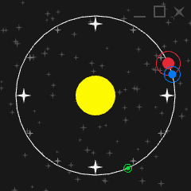

# Galaxy Clock

You can find the browser version here https://a-nameless-ghoul.itch.io/galaxy-clock.

A cool looking analogue clock for your desktop, made with raylib.

All shapes are rendered real time, no image files are used.

## Build instructions

With CMake installed run the following commands

`cmake -B build -D CMAKE_BUILD_TYPE=Release`

`cmake --build ./build`